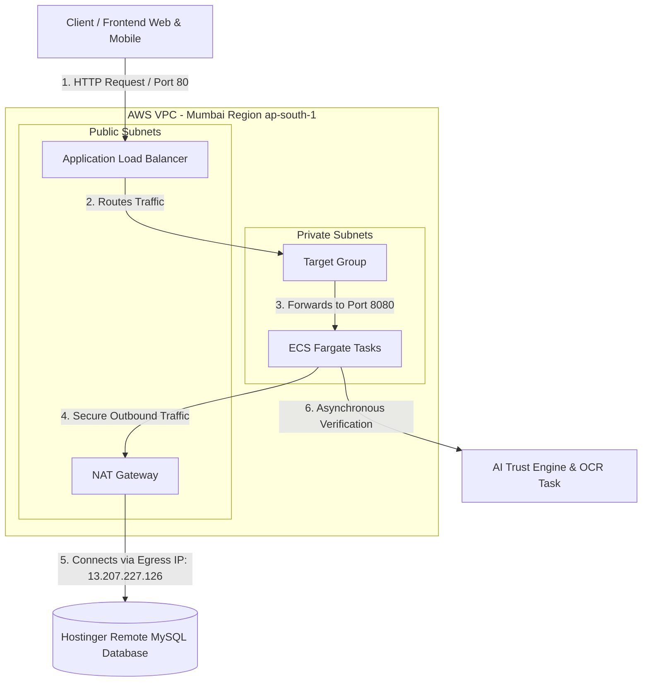
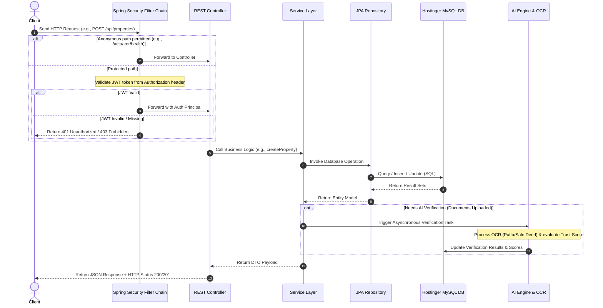
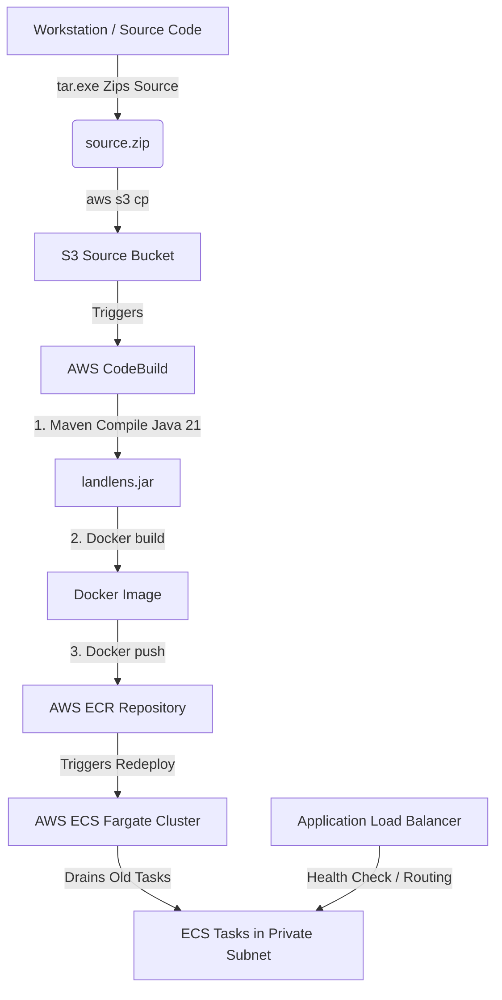

# LandLens Backend - Production Deployment & Operations Guide

Welcome to the **LandLens** backend production service guide. LandLens is a production-grade relational backend for an AI-powered Land Verification Platform built using **Spring Boot 3.4 (Java 21)** and deployed on **AWS ECS Fargate** with a **Hostinger MySQL** database.

---

## 1. Live Deployment & Endpoints (Mumbai - `ap-south-1`)

The application is deployed and running live in the AWS Mumbai region. The network utilizes an Application Load Balancer (ALB) routing to container tasks running on ECS Fargate inside private subnets, egressing through a NAT Gateway.

* **Base URL**: `http://landlens-production-alb-1919392235.ap-south-1.elb.amazonaws.com`
* **Health Check (Actuator)**: `http://landlens-production-alb-1919392235.ap-south-1.elb.amazonaws.com/actuator/health`
* **Swagger Documentation** (Enabled in dev, disabled in prod for security): `http://landlens-production-alb-1919392235.ap-south-1.elb.amazonaws.com/swagger-ui/index.html`
* **Production Database (Hostinger)**: `srv1117.hstgr.io:3306` (Schema: `u833088220_LL`, User: `u833088220_LL`)

### Egress & Whitelisting
To allow connection to external database engines (e.g. Hostinger VPS or external MySQL nodes), the outbound egress traffic flows through an Elastic IP associated with the NAT Gateway:
* **NAT Gateway Public Egress IP**: `13.207.227.126` (Must be whitelisted in Hostinger Remote MySQL settings)

---

## 2. Backend System Architecture & Request Flows

Below are the graphical representations illustrating how request traffic flows through the infrastructure and the internal request processing pipeline of the Spring Boot application container.

### A. Infrastructure & Network Topology

This diagram details the path client requests take from the public internet, routing through the Load Balancer, to the containers running inside private subnets, and finally communicating with your Hostinger database:



### B. Application Request Processing Lifecycle

This sequence diagram shows how requests (e.g. creating properties or document uploads) are intercepted by Spring Security, processed by the business controllers/services, and saved to the MySQL database:



---

## 3. Relational Database Design & Schema Specification

The database utilizes a **3NF (Third Normal Form)** relational database schema structured with `UUID` primary keys (`VARCHAR(36)`) and foreign key constraints to maintain strict referential integrity.

### Module Overview

LandLens is designed around modular boundaries to keep components decoupled, maintainable, and aligned with standard Spring Boot packages:

1. **Authentication & Access Control (RBAC)**: Manages users, Role-Based Access Control, security logs, and token sessions.
2. **Property Listing & Asset Management**: Manages property details, cataloging, spatial attributes, ownership, and structural data.
3. **Property Media**: Manages public-facing display media (images/videos) associated with properties.
4. **Verification Documents**: Stores official registry documents (e.g., Sale Deed, Patta, Tax Receipts) uploaded by owners for OCR and verification.
5. **Verification (AI & Government)**: Captures AI verification trust scores and risk evaluations, manual inspector reviews, and audit timeline transitions.
6. **Fraud & Disputes**: Tracks AI-flagged duplicate property overlaps and community dispute reports.
7. **Buyer Interaction**: Facilitates watchlist bookmarking and physical viewing/visit schedules.
8. **Notifications & Communication**: Handles real-time system alerts and interactive user-to-AI chat history.
9. **Developer API**: Manages API key hashes, tracks per-key daily usage, logs HTTP request traces, and regulates rate limits.
10. **Analytics**: Pre-aggregates daily metrics for the admin dashboard.

---

### Database Entity Relationship Diagram (ERD)

```mermaid
erDiagram
    roles {
        UUID id PK
        VARCHAR name UK
        VARCHAR description
        TIMESTAMP created_at
        TIMESTAMP updated_at
        UUID created_by
        UUID updated_by
        BOOLEAN is_active
    }

    users {
        UUID id PK
        VARCHAR email UK
        VARCHAR password_hash
        VARCHAR first_name
        VARCHAR last_name
        VARCHAR phone_number
        UUID role_id FK
        TIMESTAMP created_at
        TIMESTAMP updated_at
        UUID created_by
        UUID updated_by
        BOOLEAN is_active
    }

    refresh_tokens {
        UUID id PK
        UUID user_id FK
        VARCHAR token UK
        TIMESTAMP expiry_date
        BOOLEAN revoked
        TIMESTAMP created_at
        TIMESTAMP updated_at
        UUID created_by
        UUID updated_by
        BOOLEAN is_active
    }

    login_histories {
        UUID id PK
        UUID user_id FK
        TIMESTAMP login_timestamp
        VARCHAR ip_address
        VARCHAR user_agent
        VARCHAR status
        TIMESTAMP created_at
        TIMESTAMP updated_at
        UUID created_by
        UUID updated_by
        BOOLEAN is_active
    }

    properties {
        UUID id PK
        VARCHAR property_code UK
        VARCHAR title
        VARCHAR category
        NUMERIC area
        NUMERIC price
        TEXT description
        VARCHAR survey_number
        VARCHAR address
        NUMERIC latitude
        NUMERIC longitude
        VARCHAR district
        VARCHAR village
        VARCHAR state
        VARCHAR pincode
        VARCHAR three_sixty_image_url
        VARCHAR status
        UUID provider_id FK
        TIMESTAMP created_at
        TIMESTAMP updated_at
        UUID created_by
        UUID updated_by
        BOOLEAN is_active
    }

    property_images {
        UUID id PK
        UUID property_id FK
        VARCHAR image_url
        VARCHAR thumbnail_url
        INTEGER display_order
        TIMESTAMP created_at
        TIMESTAMP updated_at
        UUID created_by
        UUID updated_by
        BOOLEAN is_active
    }

    property_videos {
        UUID id PK
        UUID property_id FK
        VARCHAR video_url
        INTEGER duration
        VARCHAR thumbnail_url
        TIMESTAMP created_at
        TIMESTAMP updated_at
        UUID created_by
        UUID updated_by
        BOOLEAN is_active
    }

    property_documents {
        UUID id PK
        UUID property_id FK
        VARCHAR document_type
        VARCHAR file_url
        VARCHAR ocr_status
        VARCHAR verification_status
        TIMESTAMP created_at
        TIMESTAMP updated_at
        UUID created_by
        UUID updated_by
        BOOLEAN is_active
    }

    ai_verifications {
        UUID id PK
        UUID property_id FK "Unique"
        NUMERIC ai_trust_score
        NUMERIC forgery_score
        NUMERIC duplicate_score
        BOOLEAN ownership_match
        NUMERIC risk_score
        TEXT summary
        NUMERIC confidence
        TIMESTAMP generated_date
        TIMESTAMP created_at
        TIMESTAMP updated_at
        UUID created_by
        UUID updated_by
        BOOLEAN is_active
    }

    government_verifications {
        UUID id PK
        UUID property_id FK "Unique"
        UUID officer_id FK
        TEXT remarks
        VARCHAR status
        TIMESTAMP verified_date
        TIMESTAMP created_at
        TIMESTAMP updated_at
        UUID created_by
        UUID updated_by
        BOOLEAN is_active
    }

    verification_timelines {
        UUID id PK
        UUID property_id FK
        TIMESTAMP timestamp
        VARCHAR action
        TEXT remarks
        UUID user_id FK
        TIMESTAMP created_at
        TIMESTAMP updated_at
        UUID created_by
        UUID updated_by
        BOOLEAN is_active
    }

    duplicate_claims {
        UUID id PK
        UUID property_a_id FK
        UUID property_b_id FK
        NUMERIC similarity
        TEXT reason
        VARCHAR status
        VARCHAR decision
        TIMESTAMP created_at
        TIMESTAMP updated_at
        UUID created_by
        UUID updated_by
        BOOLEAN is_active
    }

    fraud_reports {
        UUID id PK
        UUID reporter_id FK
        UUID property_id FK
        VARCHAR reason
        TEXT description
        VARCHAR status
        UUID officer_id FK
        TIMESTAMP created_at
        TIMESTAMP updated_at
        UUID created_by
        UUID updated_by
        BOOLEAN is_active
    }

    property_visits {
        UUID id PK
        UUID buyer_id FK
        UUID property_id FK
        DATE visit_date
        TIME visit_time
        VARCHAR status
        TIMESTAMP created_at
        TIMESTAMP updated_at
        UUID created_by
        UUID updated_by
        BOOLEAN is_active
    }

    saved_properties {
        UUID id PK
        UUID buyer_id FK
        UUID property_id FK
        TIMESTAMP created_at
        TIMESTAMP updated_at
        UUID created_by
        UUID updated_by
        BOOLEAN is_active
    }

    notifications {
        UUID id PK
        VARCHAR title
        TEXT message
        VARCHAR type
        BOOLEAN is_read
        UUID receiver_id FK
        TIMESTAMP created_time
        TIMESTAMP created_at
        TIMESTAMP updated_at
        UUID created_by
        UUID updated_by
        BOOLEAN is_active
    }

    ai_conversations {
        UUID id PK
        UUID user_id FK
        VARCHAR title
        TIMESTAMP created_at
        TIMESTAMP updated_at
        UUID created_by
        UUID updated_by
        BOOLEAN is_active
    }

    ai_messages {
        UUID id PK
        UUID conversation_id FK
        VARCHAR sender_role
        TEXT content
        TIMESTAMP timestamp
        TIMESTAMP created_at
        TIMESTAMP updated_at
        UUID created_by
        UUID updated_by
        BOOLEAN is_active
    }

    api_keys {
        UUID id PK
        UUID user_id FK
        VARCHAR key_hash UK
        VARCHAR name
        VARCHAR prefix
        VARCHAR status
        TIMESTAMP expiry_date
        TIMESTAMP created_at
        TIMESTAMP updated_at
        UUID created_by
        UUID updated_by
        BOOLEAN is_active
    }

    api_usages {
        UUID id PK
        UUID api_key_id FK
        DATE usage_date
        INTEGER call_count
        TIMESTAMP created_at
        TIMESTAMP updated_at
        UUID created_by
        UUID updated_by
        BOOLEAN is_active
    }

    api_logs {
        UUID id PK
        UUID api_key_id FK
        VARCHAR endpoint
        VARCHAR method
        INTEGER status_code
        VARCHAR ip_address
        TIMESTAMP request_timestamp
        INTEGER response_time_ms
        TIMESTAMP created_at
        TIMESTAMP updated_at
        UUID created_by
        UUID updated_by
        BOOLEAN is_active
    }

    api_rate_limits {
        UUID id PK
        UUID api_key_id FK "Unique"
        VARCHAR limit_type
        INTEGER max_requests
        TIMESTAMP current_window_start
        TIMESTAMP created_at
        TIMESTAMP updated_at
        UUID created_by
        UUID updated_by
        BOOLEAN is_active
    }

    daily_analytics {
        UUID id PK
        DATE analytics_date UK
        INTEGER property_views
        INTEGER search_count
        INTEGER verification_count
        INTEGER fraud_count
        INTEGER api_calls
        TIMESTAMP created_at
        TIMESTAMP updated_at
        UUID created_by
        UUID updated_by
        BOOLEAN is_active
    }

    roles ||--o{ users : "assigns"
    users ||--o{ refresh_tokens : "generates"
    users ||--o{ login_histories : "attempts"
    users ||--o{ properties : "owns"
    users ||--o{ government_verifications : "performs"
    users ||--o{ verification_timelines : "triggers"
    users ||--o{ fraud_reports : "reports"
    users ||--o{ fraud_reports : "investigates"
    users ||--o{ property_visits : "schedules"
    users ||--o{ saved_properties : "saves"
    users ||--o{ notifications : "receives"
    users ||--o{ ai_conversations : "starts"
    users ||--o{ api_keys : "creates"

    properties ||--o{ property_images : "has"
    properties ||--o{ property_videos : "has"
    properties ||--o{ property_documents : "requires"
    properties ||--|| ai_verifications : "analyzed"
    properties ||--|| government_verifications : "assessed"
    properties ||--o{ verification_timelines : "logs"
    properties ||--o{ duplicate_claims : "acts-as-A"
    properties ||--o{ duplicate_claims : "acts-as-B"
    properties ||--o{ fraud_reports : "accused-in"
    properties ||--o{ property_visits : "hosts"
    properties ||--o{ saved_properties : "saved-in"

    ai_conversations ||--o{ ai_messages : "contains"
    api_keys ||--o{ api_usages : "tracks"
    api_keys ||--o{ api_logs : "records"
    api_keys ||--|| api_rate_limits : "restricts"
```



---

### Data Schema Table Details

#### Common Audit Fields (Present in EVERY Table)
* `id` (`VARCHAR(36)`, Primary Key, UUID string representation)
* `created_at` (`TIMESTAMP`, Not Null, Default `CURRENT_TIMESTAMP`)
* `updated_at` (`TIMESTAMP`, Not Null, Default `CURRENT_TIMESTAMP ON UPDATE CURRENT_TIMESTAMP`)
* `created_by` (`VARCHAR(36)`, Nullable, referencing `users(id)`)
* `updated_by` (`VARCHAR(36)`, Nullable, referencing `users(id)`)
* `is_active` (`TINYINT(1)`, Not Null, Default `1` for soft-delete)

#### Primary Modules Tables
* **`roles`**: Stores the authorization role mapping (`ADMIN`, `GOVERNMENT_OFFICER`, `PROVIDER`, `BUYER`).
* **`users`**: Contains credential hashes (BCrypt) and role associations.
* **`refresh_tokens`**: Tracks JWT session rollover tokens.
* **`login_histories`**: Audit logs tracking client IPs and session statuses.
* **`properties`**: The central entity representing real estate plots. Includes coordinates, addresses, and validation state.
* **`property_images` & `property_videos`**: Attachments showcasing the property listing.
* **`property_documents`**: Official land titles (Patta, Deeds) uploaded for verification.
* **`ai_verifications`**: Computed scores for trust, risk, forgery, and duplicate claims.
* **`government_verifications`**: Remarks and decisions (Approve/Reject) of the verifying officer.
* **`verification_timelines`**: Audit timelines tracking every transition of property verification status.
* **`duplicate_claims`**: AI flagged coordinates or details overlap between listings.
* **`fraud_reports`**: Community complaints flagged on listings.
* **`property_visits`**: Scheduled viewing dates/times between buyers and providers.
* **`saved_properties`**: Watchlist bookmarks linking buyers to properties.
* **`notifications`**: System-generated user alerts.
* **`ai_conversations` & `ai_messages`**: Chat history with the AI verification assistant.
* **`api_keys`, `api_usages`, `api_logs`, `api_rate_limits`**: Complete suite tracking developer access and request metrics.
* **`daily_analytics`**: Analytics aggregates for dashboard metrics.

---

## 3. DevOps Deployment Architecture & CI/CD Pipeline

The project utilizes a hybrid Terraform + CodeBuild pipeline that automates deployment steps directly from your workstation to ECS Fargate:



### Deployment Commands
To run the automated deployment pipeline, execute the scripts from the root directory:

**Windows PowerShell**:
```powershell
.\deploy.ps1
```

**Linux / Bash**:
```bash
./deploy.sh
```

### What the Scripts Automate:
1. **Checks Dependencies**: Ensures `aws`, `terraform`, and `tar` are installed.
2. **First-Pass Infrastructure**: Initializes and applies Terraform configs to spin up the ECR Repository, S3 bucket, and CodeBuild.
3. **Code Bundling**: Packages and zips the local workspace directory (excluding heavy binaries like `.terraform`, `terraform.exe`, and `target` to keep the size under `300KB`).
4. **Triggers CodeBuild**: Uploads the bundle to S3 and calls CodeBuild. CodeBuild starts a secure environment, compiles the application using Maven, builds the Docker container, and pushes the tagged image to the ECR repo.
5. **Second-Pass Infrastructure**: Configures the ALB, target groups, ECS Fargate Service, auto-scaling, and CloudWatch metrics.
6. **Rolling Update**: Forces a redeployment on ECS Fargate. Fargate spins up the new task replicas, waits for the health check to report status `200/UP`, routes traffic to them, and shuts down old tasks (Zero-Downtime deployment).
7. **Verifies Health**: Polls `/actuator/health` to confirm the environment is healthy.

---

## 4. Suggested Spring Boot Package Structure

To maintain clean modular boundaries corresponding to our database modules, use the following package layout:

```text
com.landlens
 ├── auth
 │    ├── controller
 │    ├── service
 │    ├── model (Role, RefreshToken, LoginHistory)
 │    ├── repository
 │    └── security (JWT filters, WebSecurityConfig)
 ├── user
 │    ├── controller
 │    ├── service
 │    ├── model (User)
 │    └── repository
 ├── property
 │    ├── controller
 │    ├── service
 │    ├── model (Property, PropertyImage, PropertyVideo, SavedProperty, PropertyVisit)
 │    └── repository
 ├── document
 │    ├── controller
 │    ├── service
 │    ├── model (PropertyDocument)
 │    └── repository
 ├── verification
 │    ├── controller
 │    ├── service
 │    ├── model (GovernmentVerification, VerificationTimeline)
 │    └── repository
 ├── ai
 │    ├── controller
 │    ├── service (AI analysis and chat connection)
 │    ├── model (AiVerification, AiConversation, AiMessage)
 │    └── repository
 ├── api
 │    ├── controller
 │    ├── service (Rate limiting and developer usage tracking)
 │    ├── model (ApiKey, ApiUsage, ApiLog, ApiRateLimit)
 │    ├── repository
 │    └── interceptor (Rate limit / API key validation)
 └── analytics
      ├── controller
      ├── service (Daily aggregates scheduler)
      ├── model (DailyAnalytics)
      └── repository
```

---

## 5. API Endpoints Reference

### Authentication
* `POST /api/auth/register` - Create user account
* `POST /api/auth/login` - Obtain Access + Refresh tokens
* `POST /api/auth/refresh` - Rotate access tokens
* `POST /api/auth/logout` - Revoke tokens

### Properties
* `POST /api/properties` - List a property
* `GET /api/properties` - List all properties (supports district, category, and price filtering)
* `GET /api/properties/{id}` - Retrieve property details
* `PUT /api/properties/{id}` - Modify listing
* `DELETE /api/properties/{id}` - Remove property
* `POST /api/properties/{id}/images` - Upload images
* `POST /api/properties/{id}/videos` - Add video tours

### OCR & AI Engine Verification
* `POST /api/properties/{id}/documents` - Upload ownership documents (e.g. `PATTA`, `SALE_DEED`)
* `POST /api/documents/{docId}/ocr` - Trigger OCR transcription and validation
* `POST /api/properties/{id}/ai-verify` - Trigger AI Trust analysis (Trust score, risk, and duplicates)

### Reviews & Timeline
* `POST /api/properties/{id}/government-verify` - Approve/Reject listing (Govt Officer only)
* `GET /api/properties/{id}/timeline` - Get audit trail history

### Buyer Interactions
* `POST /api/properties/{id}/save` - Bookmark property
* `POST /api/properties/{id}/visit` - Book physical visit tour

### Developers & Admin
* `POST /api/developer/keys` - Create dynamic API keys
* `GET /api/v1/external/properties/{code}/verify` - Fetch verification detail using API keys
* `GET /api/analytics/dashboard` - Admin analytics metrics

---

## 6. API Sample Payloads (Request & Response)

### 1. User Registration (`POST /api/auth/register`)
**Request Body**:
```json
{
  "email": "provider_2026@landlens.com",
  "password": "Password123",
  "firstName": "Builder",
  "lastName": "Prasad",
  "phoneNumber": "9876543210",
  "role": "PROVIDER"
}
```
**Response Body**:
```json
"User registered successfully with ID: 1bc76d8e-e5ca-4a6d-8c5f-2043cb36f59e"
```

### 2. User Login (`POST /api/auth/login`)
**Request Body**:
```json
{
  "email": "provider_2026@landlens.com",
  "password": "Password123"
}
```
**Response Body**:
```json
{
  "accessToken": "eyJhbGciOiJIUzI1NiJ9.eyJzdWIiOiJwcm92aWRlcl8yMDI2QGxhbmRsZW5zLmNvbSIsImlhdCI6MTc4NDEyMTMxMCwiZXhwIjoxNzg0MjA3NzEwfQ...",
  "refreshToken": "7c8e-e5ca-4a6d-8c5f-2043cb36f59e",
  "role": "PROVIDER",
  "email": "provider_2026@landlens.com"
}
```

### 3. Create Property Listing (`POST /api/properties`)
**Request Body**:
```json
{
  "title": "Premium Agricultural Plot in Guntur",
  "category": "AGRICULTURAL",
  "area": 2.5,
  "price": 4500000.0,
  "description": "High yield fertile soil near Guntur bypass road. Accessible road connection and clean title.",
  "surveyNumber": "45-A/12",
  "address": "Bypass road, Guntur Rural",
  "latitude": 16.3067,
  "longitude": 80.4365,
  "district": "Guntur",
  "village": "Gorantla",
  "state": "Andhra Pradesh",
  "pincode": "522034"
}
```
**Response Body**:
```json
{
  "id": "0aba9515-6f75-45fc-8358-cdd35cc64495",
  "propertyCode": "LL-1784121310459-119",
  "title": "Premium Agricultural Plot in Guntur",
  "category": "AGRICULTURAL",
  "area": 2.50,
  "price": 4500000.00,
  "status": "PENDING_AI",
  "surveyNumber": "45-A/12"
}
```

### 4. OCR Execution (`POST /api/documents/{docId}/ocr`)
**Response Body**:
```json
{
  "documentId": "6f3626a3-96b7-49cf-81dd-9af8e6685ecb",
  "ocrStatus": "COMPLETED",
  "verificationStatus": "VERIFIED",
  "rawText": "GOVERNMENT OF ANDHRA PRADESH - PATTA PASSBOOK... OWNER: BUILDER PRASAD... SURVEY NO: 45-A/12..."
}
```

### 5. AI Verification Checks (`POST /api/properties/{id}/ai-verify`)
**Response Body**:
```json
{
  "id": "8c5f-2043cb36f59e",
  "aiTrustScore": 88.50,
  "forgeryScore": 5.20,
  "duplicateScore": 0.00,
  "ownershipMatch": true,
  "riskScore": 12.00,
  "confidence": 95.00,
  "summary": "LandLens AI Trust engine analysis complete. High confidence ownership match. Bounds clear."
}
```

### 6. Government Inspector Review (`POST /api/properties/{id}/government-verify`)
**Request Body**:
```json
{
  "status": "APPROVED",
  "remarks": "Verified bounds on local land records maps. Matches village survey records. Approved."
}
```
**Response Body**:
```json
{
  "id": "5961bbf7-0dd9-40b6-86d5-088144a1a078",
  "status": "APPROVED",
  "remarks": "Verified bounds on local land records maps. Matches village survey records. Approved.",
  "verifiedDate": "2026-07-15T13:15:11.742383Z"
}
```
