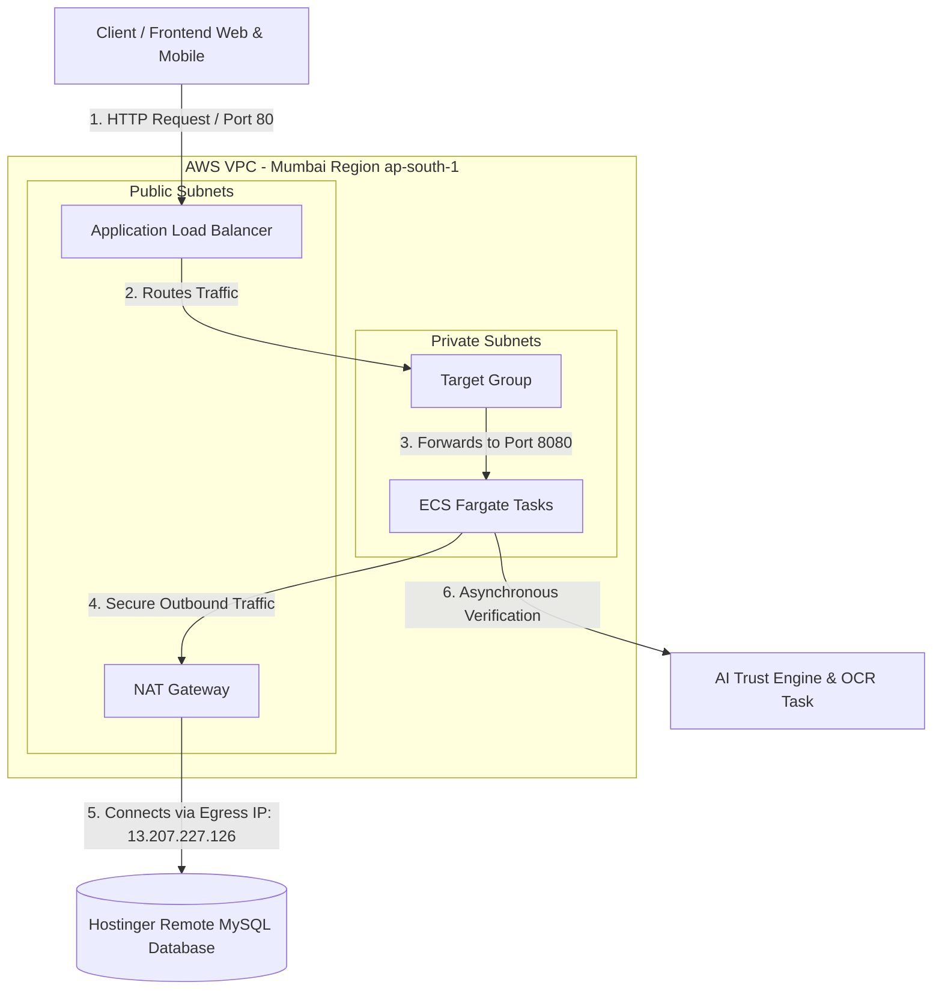
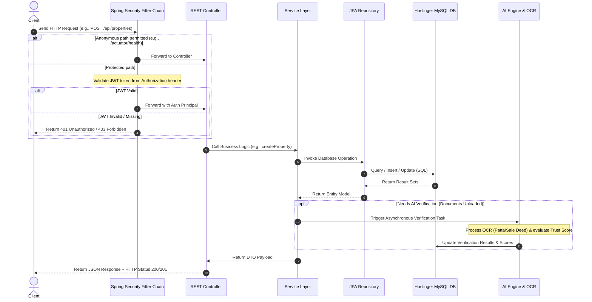
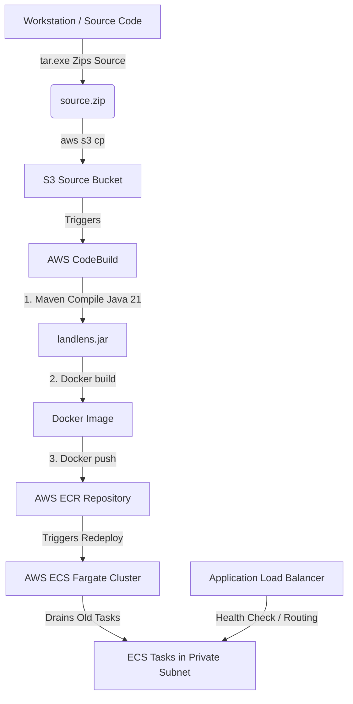
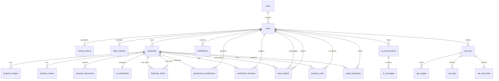

# 🌍 LandLens Backend - Production Deployment & Operations Guide

[](https://adoptium.net/)
[](https://spring.io/projects/spring-boot)
[](https://www.docker.com/)
[](https://aws.amazon.com/ecs/)
[](https://www.mysql.com/)

Welcome to the **LandLens** backend production service guide. LandLens is a production-grade relational backend for an AI-powered Land Verification Platform. The system utilizes **Spring Boot 3.4 (Java 21)**, **Spring Security (JWT)**, and **Spring Data JPA (Hibernate)**. It is configured for deployment on **AWS ECS Fargate** with a **Hostinger MySQL** database.

---

## 1. Project Description

**LandLens** is a secure, high-performance web API designed to digitize and automate the land registry verification process. By integrating Optical Character Recognition (OCR), AI-driven duplicate claims detection, and a multi-level review workflow (including government inspectors), LandLens provides a single source of truth for land asset listings. This repository contains the backend service, local orchestration configurations (Docker Compose), Infrastructure as Code (Terraform), and multiple cloud provider application templates.

---

## 2. Features

The application is structured into decoupled modules aligning with the database and package boundaries:

*   **Authentication & Access Control (RBAC)**: Managed user roles (`ADMIN`, `GOVERNMENT_OFFICER`, `PROVIDER`, `BUYER`) using stateless JWT sessions (with access and refresh token rotation) and BCrypt password encryption.
*   **Property Listing & Asset Management**: Full-featured cataloging of agricultural, commercial, industrial, and residential properties with coordinate tracking (latitude/longitude), address resolution, and pricing structures.
*   **Property Media**: Display-media integration including standard images, video walkthrough tours, and 360-degree interactive panorama image uploads.
*   **Verification Documents**: Registry document uploads (Patta, Sale Deeds, Tax Receipts) supporting OCR queues and verification statuses.
*   **AI Verification Engine**: Asynchronous trust scoring, forgery evaluation, duplicate listing detection, coordinate overlap calculations, and automated AI chat assistance for queries.
*   **Government Review Workflow**: Inspection audit trails, timeline transitions (`UPLOADED`, `AI_STARTED`, `APPROVED`, `REJECTED`, etc.), and officer remark logs.
*   **Buyer Interactions**: Property watchlists (saved items) and tour visit scheduling (date/time/status).
*   **Developer API Integration**: Management of dynamic API keys, request logging (endpoint, status code, latency, IP), and rate limits (hourly/daily window enforcement).
*   **Analytics Aggregator**: Daily analytics pre-aggregation scheduler summarizing views, searches, verifications, frauds, and API usage statistics for dashboard reporting.

---

## 3. Technology Stack

*   **Core Framework**: Spring Boot 3.4.0 (Java 21)
*   **Security & Auth**: Spring Security, JWT (JJWT 0.12.5), BCrypt
*   **Database & ORM**: Hibernate (JPA), MySQL Connector J, HikariCP Connection Pool
*   **API Documentation**: Springdoc OpenAPI / Swagger UI (v2.8.9)
*   **Health & Metrics**: Spring Boot Actuator
*   **Containerization**: Docker, Docker Compose
*   **CI/CD & IaC**: Terraform, AWS CodeBuild, AWS Systems Manager, Amazon ECR
*   **Cloud Infrastructure**: AWS ECS Fargate, ALB (Application Load Balancer), Route 53, NAT Gateway, KMS, AWS Secrets Manager

---

## 4. Live Deployment & Endpoints (Mumbai - `ap-south-1`)

The production application is running live in the AWS Mumbai region. Client requests route through an Application Load Balancer (ALB) into container tasks running inside private subnets, egressing through a NAT Gateway for external network calls.

*   **Base URL**: `http://landlens-production-alb-1919392235.ap-south-1.elb.amazonaws.com`
*   **Health Check (Actuator)**: `http://landlens-production-alb-1919392235.ap-south-1.elb.amazonaws.com/actuator/health`
*   **Swagger Documentation**: `http://landlens-production-alb-1919392235.ap-south-1.elb.amazonaws.com/swagger-ui/index.html` (Enabled in development, disabled in production for security hardening)
*   **Production Database (Hostinger)**: `srv1117.hstgr.io:3306` (Schema: `u833088220_LL`, User: `u833088220_LL`)
*   **NAT Gateway Public Egress IP**: `13.207.227.126` (Whitelisted in Hostinger Remote MySQL settings)

---

## 5. Project Architecture & Request Flows

### A. Infrastructure & Network Topology
Client requests flow through the public internet, route via the Application Load Balancer to ECS Fargate tasks inside private subnets, and query the Hostinger Remote MySQL Database through a NAT Gateway egress IP:



### B. Application Request Processing Lifecycle
Protected paths intercept and validate incoming JWTs. If valid, Spring Security forwards the context to REST Controllers, Services, and JPA Repositories, executing asynchronous tasks when documents require verification:



---

## 6. Folder Structure

### Root Directory Structure

```text
landlens-backend/
 ├── .mvn/                     # Maven Wrapper directory
 ├── deploy-guides/            # Execution blueprints for specific clouds
 │    ├── azure-deploy.sh      # Deployment guide for Microsoft Azure App Service
 │    └── hostinger-deploy.sh  # Deployment guide for Hostinger VPS & MySQL setup
 ├── src/                      # Source code directory
 │    ├── main/
 │    │    ├── java/           # Java source files (packaged under com.landlens)
 │    │    └── resources/      # Application properties, schemas, logs
 │    └── test/                # Unit & Integration test sources
 ├── terraform/                # Infrastructure-as-code for AWS deployments
 ├── .dockerignore             # Docker build ignores
 ├── .gitattributes            # Git attributes specification
 ├── .gitignore                # Git exclusions (build targets, logs, credentials)
 ├── app.yaml                  # DigitalOcean App Platform spec
 ├── buildspec.yml             # AWS CodeBuild configuration
 ├── Dockerfile                # Multi-stage production container build
 ├── Dockerrun.aws.json        # AWS Elastic Beanstalk container runner
 ├── docker-compose.yml        # Development database and app orchestrator
 ├── koyeb.yaml                # Koyeb deployment specification
 ├── railway.json              # Railway deployment config
 ├── render.yaml               # Render platform service definition
 ├── service.yaml              # Cloud Run / Kubernetes service definition
 ├── pom.xml                   # Maven dependencies and plugin builds
 ├── deploy.ps1                # Windows PowerShell deployment pipeline
 ├── deploy.sh                 # Unix Bash deployment pipeline
 ├── verify_api.ps1            # End-to-end integration test runner script
 └── verify_all_endpoints.ps1  # Advanced automated test pipeline
```

### Spring Boot Package Layout

The application code follows a package-by-feature structure under `src/main/java/com/landlens/`:

```text
com.landlens
 ├── LandlensApplication.java  # Application Entry Point
 ├── auth                      # Authorization, Security Config, and Users
 │    ├── controller          # Auth REST Controllers (Register, Login, Refresh)
 │    ├── dto                 # Request/Response data transfer classes
 │    ├── model               # Entities: Role, RefreshToken, LoginHistory
 │    ├── repository          # JPA Repositories
 │    ├── security            # JWT provider, filters, and WebSecurityConfig
 │    └── service             # Authorization business logic
 ├── user                      # User Profile Management
 │    ├── controller
 │    ├── model               # Entity: User
 │    ├── repository
 │    └── service
 ├── property                  # Listings, Images, Videos, Saved, & Bookings
 │    ├── controller          # Property, Image, Video REST controllers
 │    ├── dto
 │    ├── mapper              # MapStruct/Manual converters
 │    ├── model               # Entities: Property, PropertyImage, PropertyVideo, SavedProperty, PropertyVisit
 │    ├── repository
 │    └── service
 ├── document                  # Verification registry document uploads
 │    ├── controller
 │    ├── model               # Entity: PropertyDocument
 │    ├── repository
 │    └── service
 ├── verification              # Government Review and Timeline transitions
 │    ├── controller
 │    ├── model               # Entities: GovernmentVerification, VerificationTimeline
 │    ├── repository
 │    └── service
 ├── ai                        # AI scoring outputs and chatbot messages
 │    ├── controller
 │    ├── model               # Entities: AiVerification, AiConversation, AiMessage
 │    ├── repository
 │    └── service
 ├── fraud                     # Duplicate claim coordinates & community reports
 │    ├── controller
 │    ├── model               # Entities: DuplicateClaim, FraudReport
 │    ├── repository
 │    └── service
 ├── notification              # Real-time alerts and user logs
 │    ├── controller
 │    ├── model               # Entity: Notification
 │    ├── repository
 │    └── service
 ├── api                       # Developer API key, rate-limiting, and logs
 │    ├── controller          # Developer & External verification controllers
 │    ├── dto
 │    ├── interceptor         # ApiKeyInterceptor (checks headers and rate-limits)
 │    ├── mapper
 │    ├── model               # Entities: ApiKey, ApiUsage, ApiLog, ApiRateLimit
 │    ├── repository
 │    └── service
 └── analytics                 # Daily dashboard statistics pre-aggregation
      ├── controller
      ├── model               # Entity: DailyAnalytics
      ├── repository
      └── service
```

---

## 7. Prerequisites

Ensure you have the following installed locally:
1.  **Java Development Kit (JDK) 21**: Recommended OpenJDK 21 (Temurin).
2.  **Maven 3.9+**: For building the application (or use `./mvnw` / `mvnw.cmd`).
3.  **Docker & Docker Compose**: For container execution and database containerization.
4.  **AWS CLI & Terraform**: Needed only if executing cloud deployment scripts.

---

## 8. Installation Instructions

1.  **Clone the Repository**:
    ```bash
    git clone https://github.com/pirates27/backend.git
    cd backend
    ```

2.  **Set Up Local Configuration**:
    Copy files and update environment settings if needed. By default, `application.properties` loads development defaults which boot cleanly with the Docker Compose database.

---

## 9. Environment Variables

The application relies on the following environment variables. If left undefined, local default fallbacks are used:

| Variable Name | Description | Default Fallback (Development) |
|---|---|---|
| `DB_URL` | JDBC Connection URL for MySQL | `jdbc:mysql://localhost:3306/landlens?useSSL=false...` |
| `DB_USERNAME` | Database Authentication User | `root` |
| `DB_PASSWORD` | Database Authentication Password | `[blank]` |
| `JWT_SECRET` | HMAC SHA-256 Signature Secret | `9a2f3f4e5d6c7b8a9f0e1d2c3b4a5f6e7d8c9b0a1f2e3d4c5b6a7f8e9d0c1b2a3` |
| `JWT_EXPIRATION_MS` | JWT Access Token duration (ms) | `86400000` (24 Hours) |
| `JWT_REFRESH_EXPIRATION_MS` | Refresh Token expiry duration (ms) | `2592000000` (30 Days) |
| `SPRING_PROFILES_ACTIVE` | Active profile (`prod` or `dev`) | `default` (Runs as development) |
| `PORT` | Embedded server port | `8080` |

---

## 10. Database Setup

The backend connects to a MySQL relational database. The schema is normalized into **3NF (Third Normal Form)** tables. 

1.  **Initialization Script**:
    The database structure is detailed in [schema.sql](file:///c:/Users/vasav/OneDrive/Desktop/Land_Lens/back_end/src/main/resources/schema.sql). The application executes this automatically in production or when starting the containerized setup.
2.  **Common Audit Fields**:
    Every main table has audit attributes to maintain full integrity:
    *   `id` (`VARCHAR(36)`, UUID string representation)
    *   `created_at` (`TIMESTAMP`, Default `CURRENT_TIMESTAMP`)
    *   `updated_at` (`TIMESTAMP`, Default `CURRENT_TIMESTAMP ON UPDATE CURRENT_TIMESTAMP`)
    *   `is_active` (`TINYINT(1)`, soft-delete indicator)
3.  **Hibernate Settings**:
    *   **Development**: `spring.jpa.hibernate.ddl-auto=update` is active to dynamically synchronize models.
    *   **Production**: `spring.jpa.hibernate.ddl-auto=none` is enforced for structural safety.

---

## 11. Running Locally

You can launch the project on your local machine:

```powershell
# Using the Maven wrapper
.\mvnw.cmd spring-boot:run
```

The server will start listening at `http://localhost:8080`.

---

## 12. Running with Docker (Local Development)

The easiest way to boot the database and the backend app in an isolated network is using Docker Compose:

1.  **Start Services**:
    ```bash
    docker-compose up --build -d
    ```
    This launches a MySQL database container initialized with the schema, followed by the Spring Boot container.

2.  **Stop Services**:
    ```bash
    docker-compose down -v
    ```

---

## 13. API Documentation (Swagger/OpenAPI)

The application publishes API specifications dynamically:

*   **Swagger UI Page**: `http://localhost:8080/swagger-ui/index.html` (Accessible in local/dev profiles)
*   **OpenAPI Specs Document**: `http://localhost:8080/v3/api-docs`

---

## 14. Deployment Options

LandLens is built cloud-agnostically and supports various deployment workflows:

### A. Docker Deployments (Cloud Templates)

1.  **Koyeb (`koyeb.yaml`)**:
    Deploys container tasks pulling secrets from `secret.DB_URL`, `secret.DB_USERNAME`, etc. It sets health checks to `/actuator/health` on port `8080`.
2.  **Render (`render.yaml`)**:
    Uses Render Blueprint configurations to deploy a starter service building from the `Dockerfile`.
3.  **Railway (`railway.json`)**:
    Deploys multi-replica containers with an `ON_FAILURE` restart policy.
4.  **DigitalOcean App Platform / App Engine (`app.yaml`)**:
    Deploys the service in two-instance configurations with initial delay checks.

### B. AWS ECS Fargate + ALB Infrastructure (Production Blueprint)

The production configuration runs a hybrid Terraform + CodeBuild pipeline that packages and rolls out updates from your command line:



#### Executing AWS Deployment
Run the automated build & release script from the root directory:

**Windows PowerShell**:
```powershell
.\deploy.ps1
```

**Linux / Bash**:
```bash
./deploy.sh
```

The script manages structural initialization via Terraform, bundles your workspace (omitting caches), pushes it to AWS S3, triggers CodeBuild for Compilation/ECR pushing, and enforces zero-downtime rolling updates on ECS Fargate tasks.

---

## 15. Build Instructions

To compile and package the application into an executable `.jar` file without executing integration tests:

```powershell
.\mvnw.cmd clean package -DskipTests
```
The output file `landlens-0.0.1-SNAPSHOT.jar` will be generated inside the `target/` directory.

---

## 16. Testing Instructions

To run the JUnit test suite:

```powershell
.\mvnw.cmd test
```

> [!IMPORTANT]  
> **Database Requirement for Tests:**  
> The `LandlensApplicationTests` class boots the Spring Application Context. Because the project does not include an in-memory SQL database (such as H2), it queries the configured MySQL instance on `localhost:3306`. If a MySQL service is not running or accessible, the integration test will fail with a `java.sql.SQLException: Access denied` or `Connection Refused` error.
> 
> To test successfully, run `docker-compose up mysql` in a separate terminal before executing `.\mvnw.cmd test`. Alternatively, skip the test phase using `-DskipTests` during build steps.

---

## 17. Security Features

*   **Credential Encryption**: Secure hashing using BCrypt for all password fields inside the `users` table.
*   **Token Authorization**: Custom `JwtAuthenticationFilter` intercepts HTTP headers to validate bearer signatures.
*   **Security Policy**: Stateless session management, explicitly allowing anonymous GET requests to public property listings and actuator endpoints, while forcing credential validation for mutations.
*   **External API Guarding**: Interceptor (`ApiKeyInterceptor`) locks all `/api/v1/external/**` routes. Calls require a valid `x-api-key` header.
*   **Rate Limits**: Automated tracker logs developer usage and blocks keys exceeding defined thresholds (429 Rate Limit Exceeded).

---

## 18. Database Schema Overview (Entity Relationship Diagram)



---

## 19. Production Credentials & Encryption Reference

Production credentials are encrypted using AWS KMS and managed securely in **AWS Secrets Manager**. They are injected dynamically at container launch into Fargate tasks:

1.  **AWS Deployer IAM User**:
    *   **Access Key ID**: `AKIATXTJV...[MASKED_FOR_SECURITY]...GAWJ`
    *   **Secret Access Key**: `taHtZX0a2mVz7SHuGG...[MASKED_FOR_SECURITY]...M8o`
2.  **Production MySQL Database (Hostinger)**:
    *   **Host**: `srv1117.hstgr.io`
    *   **Port**: `3306`
    *   **Database Name**: `u833088220_LL`
    *   **Username**: `u833088220_LL`
    *   **Password**: `833088220...[MASKED_FOR_SECURITY]...Ll1`
    *   **JDBC URL**: `jdbc:mysql://srv1117.hstgr.io:3306/u833088220_LL?useSSL=false&allowPublicKeyRetrieval=true&serverTimezone=UTC&useInformationSchema=true`
3.  **Secrets Management Commands**:
    *   Retrieve secrets:
        ```powershell
        aws secretsmanager get-secret-value --secret-id landlens-production-db-credentials --region ap-south-1
        ```
    *   Encrypt / Update secrets:
        Save to file then upload:
        ```powershell
        aws secretsmanager put-secret-value --secret-id landlens-production-db-credentials --secret-string file://temp_secret.json --region ap-south-1
        ```

---

## 20. Future Improvements

*   **Test Isolation with H2**: Integrate a mock H2 in-memory profile (`application-test.properties`) so unit and integration tests run successfully during build processes without needing an active MySQL instance.
*   **Redis Caching Layer**: Add a Redis cache wrapper for public property search endpoints to decrease queries to remote database instances.
*   **Asynchronous Message Queue**: Transition AI processing and OCR triggers from inline threads to a RabbitMQ/Kafka queue to scale verification worker nodes separately.
*   **Geospatial Indexes**: Convert simple latitude/longitude coordinate floats into spatial datatypes using `Hibernate Spatial` + `MySQL Spatial` to support polygon searches.

---

## 21. Contributing Guidelines

1.  Create a feature branch from `main` (`git checkout -b feature/amazing-feature`).
2.  Commit your changes using meaningful, structured commit messages.
3.  Run unit tests with a local database enabled and verify target builds clean.
4.  Submit a Pull Request targeting the `main` branch.

---

## 22. License

This project is released under the standard licensing terms of LandLens. Please consult [LICENSE.txt](file:///c:/Users/vasav/OneDrive/Desktop/Land_Lens/back_end/LICENSE.txt) for more info.
